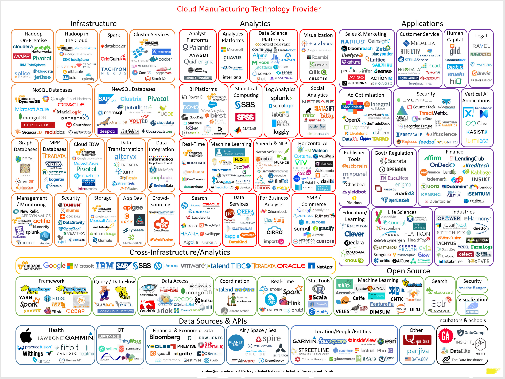
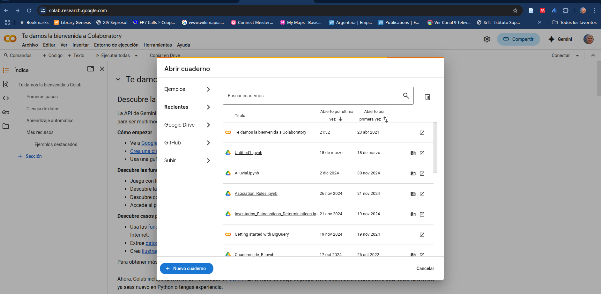
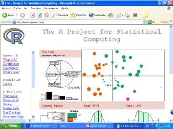
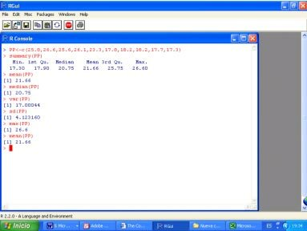
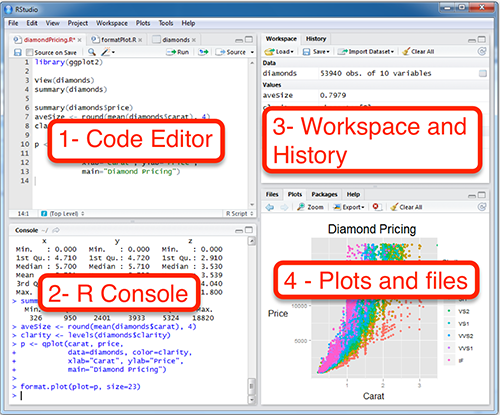
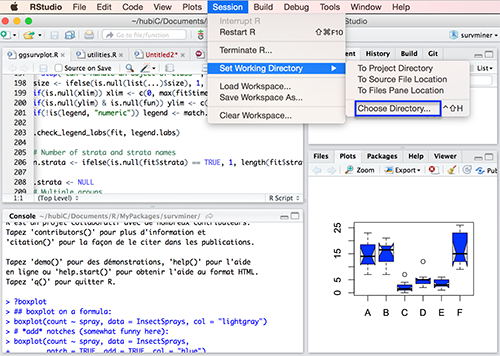
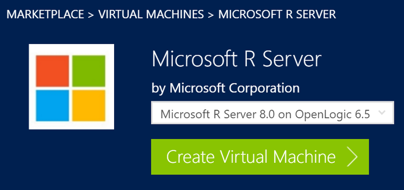
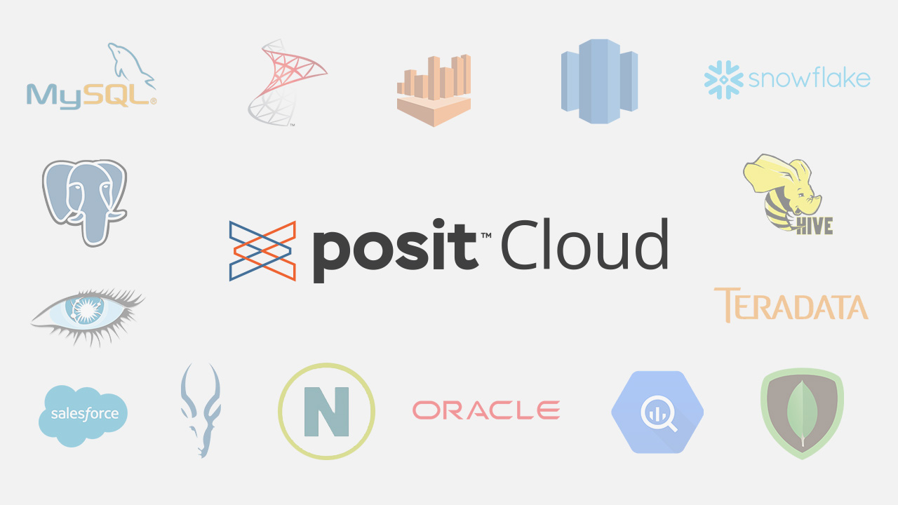

```{r setup, include=FALSE}
## Global options
knitr::opts_chunk$set(cache = TRUE)
```

# Maestría en Logística

## Gestión de Tecnologías en SCM

```         
Dr. Ricardo R. Palma <ricardorpalma@gmail.com> 
```

Universidad Nacional de Cuyo

# Tecnologías Emergentes

[](https://github.com/ricardorpalma/Gestion_Tecnologias/blob/main/images/BigData.jpg)Mapa Tecnologías Emergentes

Descarga el mapa mental de este link <https://github.com/ricardorpalma/Gestion_Tecnologias/blob/main/images/BigData.jpg>

# Conceptor sobre el significado de tecnología

La palabra "tecnología" deriva del griego antiguo. Se compone de dos términos: **"téchnē"** (τέχνη), que significa "arte, oficio, habilidad" y **"lógos"** (λόγος), que se traduce como "estudio, tratado" o "palabra". Por lo tanto, etimológicamente, "tecnología" se refiere al estudio o tratado del arte, oficio o habilidades, o al conocimiento aplicado a la creación de herramientas, técnicas y procesos para resolver problemas y satisfacer necesidades.

La acepción más aceptada es que tecnología debería traducirse como **Herramientas**

# El sindorme USTED

USTED es el acrónimo de **U**so **S**ubdesarrollado de **TE**cnologías **D**esarrolladas

-   Si antes utilizabas una piedra para clavar clavos y no te lastimabas los dedos, pero ...

-   Hoy usas un martillo que lo tomas por el hierro y le pegas al clavo con la madera y te lastimas todas las manos

-   Entonces padeces el sindrome **USTED**

## La tecnología Github

-   Crear una cuenta en github

-   Crear un repositorio para desarrollar la evaluación y un archivo readme.md

-   Buscar el repositorio de esta clase

-   Descargar la clase completa como archivo .zip

-   Conforme varamos avanzando sube los materiales

[Material de esta clase]<https://github.com/ricardorpalma/Gestion_Tecnologias>

```         
tips No uses espacios en el nombre de archivos o carpetas
```

## El archivo readme.md y el lenguaje Markdown

```         
  ## Título
  ### Subtítulo
  Este es un ejemplo de texto que da entrada a una lista genérica de elementos:
  - Elemento 1
  - Elemento 2
  - Elemento 3
  Este es un ejemplo de texto que da entrada a una lista numerada:
  1. Elemento 1
  2. Elemento 2
  3. Elemento 3
  Al texto en Markdown puedes añadirle formato como **negrita** o *cursiva* de una manera muy sencilla.
  
```

El archivo readme.md es fundamental para que el grupo de trabajo sepa qué tiene cada archivo del repositorio y en qué fecha los integrantes del equipo lo han modificado.

Puedes recuperar los archivos viejos (versiones anteriores) utilizando branchs

```         
  Ejercicio: Escribe un texto en markdown utilizando el procesador de google docs
  Descarga el "machete" rmarkdown"
```

# Si tienes máquina modesta, usa los "colaboratorios"

Además de poder utilizar markdown en google docs, es muy común utilizarlos en los co-laboratoies

Ver <https://colab.research.google.com/>

Esta plataforma te permite armar notebooks (cuadernos) que son documentos creados en markdown, pero que te permiten mezclar el cuerpo del texto y sus títulos con código de programación

**No te asustes** no tendrás que programar para aprobar la maestría, pero poco a poco verás que el uso de excel y word está totalmente obsoleto y este camino de los **notebooks** para porducir textos e incluso tesis como veremos en el próximo módulo.

La programación que se realiza es muy breve, es lo que se denomina técnicamente \*\*scripts\* de pocas líneas, como las que utlizaremos para hacer algunos ejemplos de inteligencia artificial, machine learning y hasta LLMs.

Originalmente los notebooks estaban previstos para hacerse en **Python**, pero hoy es posible hacerlo en lenguajes más cercanos al usuario final como **R-Cran**.

Ver <https://cran.r-project.org/>

Un valor agragado que tienen los google colabs es que puedes armar máquina virtuales con mucha capacidad con varios procesadores con muchos núcleos, memoria RAM y GPU Vectoriales y Tensoriales.



# R y Rstudio

**R-cran**

Es un lenguaje muy simple, parecido a matlab, por que utiliza matrices como objeto de cálculo. Fue credo por docentes e investigadores del área de estadísticas y eso es de mucho valor para la logística.

{width="70%"}

{width="70%"}

**R-Studio**

Es una interface gráfica (IDE) que te permite construir un laboratorio para armar material de comunicación

Tu te preocupas por lo que quieres comunicar, R-Studio se preocupa por convertirlo a word, excel o ppt , o mejor aún armar un notebook con metadatos.

## Tipo de instalaciones de R-Studio

-   Instalación en tu propia máquina (stand alone)

Instalas primero R-Cran y luego R-Studio. No necesitas internet para poder utilizar todo el potencial del programa

{width="100%"}



-   Instalación R-Studio Server

    Descargas la versión R-Server y puedes instalarla en un servidor en tu intranet. Siempre que tu red interna funcione todas las máquinas conectadas a la red podrán utilizar R-Studio sin instalar nada. Esto permite que una persona se encargue de mantener actualizado el software para todos los clientes. También puedes contratar un Windows AZURE con R-Server ya instalado



-   Uso de R-Studio Clowd

    Es semejante a Google Colab, no tienes que instalar nada, solamente se creas un usuario y todo está disponible para ti

    

<!-- -->

-   

-   
